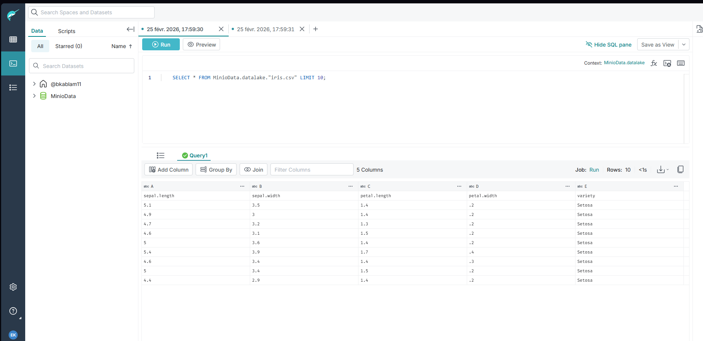
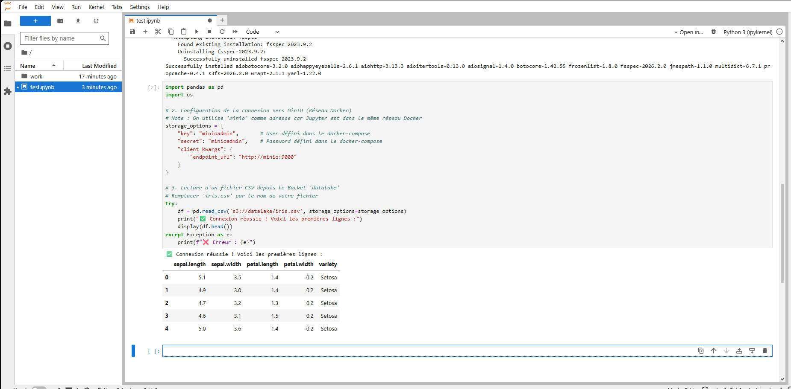
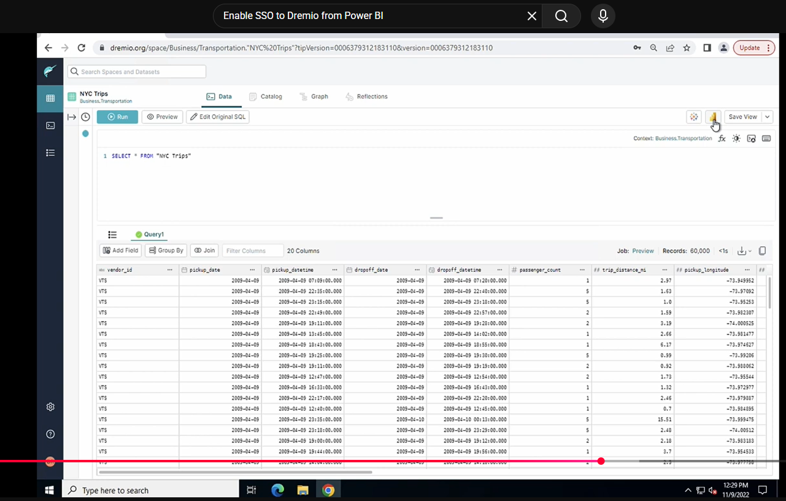
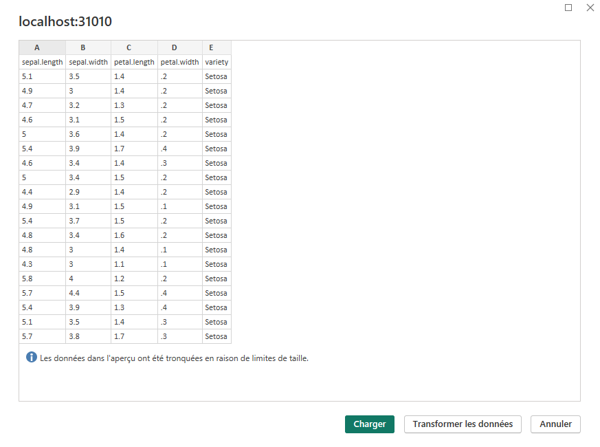

# Guide Complet : Data Lakehouse Local avec Dremio, MinIO et Power BI

Ce guide explique comment déployer et utiliser une architecture Data Lakehouse complète en local à l'aide de Docker.

**Objectif :** Mettre en place un environnement fonctionnel pour stocker des données (MinIO), les requêter avec du SQL ultra-rapide (Dremio), et les analyser avec des outils de Data Science (Jupyter) et de Business Intelligence (Power BI).

---

## Table des Matières
- [Guide Complet : Data Lakehouse Local avec Dremio, MinIO et Power BI](#guide-complet--data-lakehouse-local-avec-dremio-minio-et-power-bi)
  - [Table des Matières](#table-des-matières)
  - [1. Architecture des Composants](#1-architecture-des-composants)
  - [2. Prérequis et Installation](#2-prérequis-et-installation)
    - [A. Installer Docker Desktop](#a-installer-docker-desktop)
    - [B. Récupérer le Projet](#b-récupérer-le-projet)
    - [C. (Optionnel) Télécharger les Images Manuellement](#c-optionnel-télécharger-les-images-manuellement)
  - [3. Démarrage et Accès aux Services](#3-démarrage-et-accès-aux-services)
    - [A. Lancer l'Environnement](#a-lancer-lenvironnement)
    - [B. Tableau de Bord des Accès](#b-tableau-de-bord-des-accès)
  - [4. Configuration Initiale](#4-configuration-initiale)
    - [A. MinIO : Créer un Bucket et Ajouter des Données](#a-minio--créer-un-bucket-et-ajouter-des-données)
    - [B. Dremio : Connecter la Source de Données MinIO](#b-dremio--connecter-la-source-de-données-minio)
      - [Onglet "General"](#onglet-general)
      - [Onglet "Advanced Options"](#onglet-advanced-options)
  - [5. Analyse et Exploration des Données](#5-analyse-et-exploration-des-données)
    - [A. Avec Dremio (Requêtes SQL)](#a-avec-dremio-requêtes-sql)
    - [B. Avec JupyterLab (Python)](#b-avec-jupyterlab-python)
    - [C. Avec Power BI (Visualisation)](#c-avec-power-bi-visualisation)
  - [](#)
  - [6. Gestion de l'Environnement Docker](#6-gestion-de-lenvironnement-docker)

---

## 1. Architecture des Composants

| Service | Rôle | Accès Local |
| :--- | :--- | :--- |
| **MinIO** | Data Lake (Stockage d'objets S3) | `http://localhost:9001` |
| **Dremio** | Data Lakehouse (Moteur de requête SQL) | `http://localhost:9047` |
| **JupyterLab**| Data Science (Analyse en Python) | `http://localhost:8888` |

---

## 2. Prérequis et Installation

### A. Installer Docker Desktop
Assurez-vous que Docker Desktop est installé et en cours d'exécution.
- **Windows :** [Lien de téléchargement](https://desktop.docker.com/win/main/amd64/Docker%20Desktop%20Installer.exe)
- **Mac :** [Lien de téléchargement](https://desktop.docker.com/mac/main/amd64/Docker.dmg)

Installez-le et redémarrez votre ordinateur si nécessaire.

### B. Récupérer le Projet
Clonez ce dépôt Git dans un dossier de votre choix.
```bash
git clone https://github.com/bkablam11/demo-minio-dremio.git
```
**Important :** Naviguez dans le dossier du projet avant de lancer toute autre commande.
```bash
cd demo-minio-dremio
```

### C. (Optionnel) Télécharger les Images Manuellement
Pour éviter les erreurs de réseau (`TLS handshake timeout`), vous pouvez télécharger les images Docker en amont.
```bash
docker pull dremio/dremio-oss
docker pull minio/minio
docker pull jupyter/scipy-notebook
```

---

## 3. Démarrage et Accès aux Services

### A. Lancer l'Environnement
Utilisez Docker Compose pour démarrer tous les services en arrière-plan.
```bash
docker-compose up -d
```
> **Vérification :** Ouvrez Docker Desktop pour voir les conteneurs `minio`, `dremio`, et `jupyter` allumés en vert.

### B. Tableau de Bord des Accès

| Service | URL | Utilisateur | Mot de passe |
| :--- | :--- | :--- | :--- |
| **Dremio** | [http://localhost:9047](http://localhost:9047) | *(à créer au premier lancement `bkablam11`)* | *(à créer au premier lancement`Mercimaman2010@`)* |
| **MinIO** | [http://localhost:9001](http://localhost:9001) | `minioadmin` | `minioadmin` |
| **JupyterLab**| [http://localhost:8888](http://localhost:8888) | - | `password` |

---

## 4. Configuration Initiale

### A. MinIO : Créer un Bucket et Ajouter des Données
1.  Accédez à MinIO : **[http://localhost:9001](http://localhost:9001)**.
2.  Connectez-vous avec `minioadmin` / `minioadmin`.
3.  Créez un **Bucket** (ex: `datalake`).
4.  Uploadez des fichiers de données (CSV, Parquet...) dans ce bucket. Vous pouvez aussi simplement glisser/déposer des fichiers dans le dossier `./minio-data/datalake` sur votre ordinateur.


### B. Dremio : Connecter la Source de Données MinIO
C'est l'étape cruciale où Dremio se connecte à MinIO.
1.  Accédez à Dremio : **[http://localhost:9047](http://localhost:9047)** et créez votre compte administrateur.
2.  Cliquez sur **Add Source** et sélectionnez **Amazon S3**.


3.  Remplissez les onglets comme suit :

#### Onglet "General"
- **Name :** `MinioData` (ou le nom de votre choix)
- **Authentication :** `AWS Access Key`
- **AWS Access Key :** `minioadmin`
- **AWS Access Secret :** `minioadmin`
- **Encrypt connection :** ❌ **DÉCOCHEZ CETTE CASE** (obligatoire pour une connexion HTTP locale).


#### Onglet "Advanced Options"
Ajoutez les propriétés de connexion suivantes pour pointer vers votre conteneur MinIO local.
| Name (Nom) | Value (Valeur) | Explication |
| :--- | :--- | :--- |
| **`fs.s3a.endpoint`** | `minio:9000` | Adresse du conteneur MinIO dans le réseau Docker. |
| **`fs.s3a.path.style.access`** | `true` | Format d'URL compatible avec MinIO. |
| **`dremio.s3.compat`** | `true` | Mode de compatibilité S3 de Dremio. |

> **⚠️ Attention :** N'utilisez jamais `localhost:9000`. Les conteneurs communiquent via leur nom de service sur le réseau Docker.

4.  Cliquez sur **Save**. Votre stockage est maintenant visible dans Dremio.


---

## 5. Analyse et Exploration des Données

### A. Avec Dremio (Requêtes SQL)
1.  **Transformer un Fichier en Table :**
    - Dans Dremio, naviguez jusqu'à votre fichier CSV dans la source `MinioData`.
    - Cliquez sur l'icône de formatage à droite, configurez le délimiteur (ex: `,`) et cochez **Extract Field Names**.
    - Sauvegardez. L'icône du fichier devient violette, indiquant qu'il est prêt à être requêté.
2.  **Exécuter des Requêtes SQL :**
    - Ouvrez le **SQL Runner** et exécutez des commandes sur vos données.
    ```sql
    -- Requête simple
    SELECT * FROM MinioData.datalake."iris.csv" LIMIT 10;
    
    -- Agrégation
    SELECT species, COUNT(*) as count
    FROM MinioData.datalake."iris.csv"
    GROUP BY species;
    ```


3.  **Créer une Vue (Virtual Dataset) :**
    - Après avoir exécuté une requête, cliquez sur **Save View As...** pour sauvegarder votre logique d'analyse sans dupliquer les données.

### B. Avec JupyterLab (Python)
1.  **Accès :** Allez sur **[http://localhost:8888](http://localhost:8888)** et entrez le mot de passe `password`.
2.  **Créer un Notebook** et utilisez le code suivant pour vous connecter à MinIO et charger des données dans un DataFrame Pandas.
```python
# 1. Installation des librairies nécessaires
!pip install s3fs pandas

import pandas as pd

# 2. Configuration de la connexion à MinIO
storage_options = {
    "key": "minioadmin",
    "secret": "minioadmin",
    "client_kwargs": {
        "endpoint_url": "http://minio:9000"
    }
}

# 3. Lecture d'un fichier depuis un bucket
try:
    df = pd.read_csv('s3://datalake/iris.csv', storage_options=storage_options)
    print("✅ Données chargées avec succès !")
    display(df.head())
except Exception as e:
    print(f"❌ Erreur de connexion : {e}")


# 1. Installation des librairies nécessaires
!pip install s3fs pandas

import pandas as pd

# 2. Configuration de la connexion à MinIO
storage_options = {
    "key": "minioadmin",
    "secret": "minioadmin",
    "client_kwargs": {
        "endpoint_url": "http://minio:9000"
    }
}

# 3. Lecture d'un fichier depuis un bucket
try:
    df = pd.read_csv('s3://datalake/iris.csv', storage_options=storage_options)
    print("✅ Données chargées avec succès !")
    display(df.head())
except Exception as e:
    print(f"❌ Erreur de connexion : {e}")
```


### C. Avec Power BI (Visualisation)
0.**Download Powerbi**
a. Windows [PowerBi](https://download.microsoft.com/download/8/8/0/880bca75-79dd-466a-927d-1abf1f5454b0/PBIDesktopSetup_x64.exe)
b. Pas disponible.
1.  **Installer le Driver ODBC :**
    - Téléchargez et installez le **Windows 64-bit ODBC Installer** depuis la [page des drivers Dremio](https://www.dremio.com/drivers/odbc/).
2.  **Configurer la Source de Données ODBC :**
    - Dans la recherche Windows, ouvrez **"Administrateur de sources de données ODBC (64 bits)"**.
    - Sous `Sources de données système`, cliquez sur `Ajouter...` et sélectionnez `Dremio Connector`.
    - Configurez comme suit :
        - **Data Source Name :** `DremioDocker`
        - **Host :** `localhost`
        - **Port :** `31010`
        - **Authentication :** `Plain`
        - **User/Password :** Vos identifiants Dremio.
    - Testez et sauvegardez la connexion.
3.  **Connecter Power BI :**
    - Dans Power BI, choisissez `Obtenir les données` > `Plus...` > `ODBC`.
    - Sélectionnez `DremioDocker` (le nom de votre source de données) dans la liste déroulante.
    - Naviguez jusqu'à vos données et commencez à créer vos tableaux de bord.




---

## 6. Gestion de l'Environnement Docker
- **Allumer les conteneurs actifs :**
  ```bash
  docker-compose up -d
  ```

- **Vérifier les conteneurs actifs :**
  ```bash
  docker ps
  ```
- **Arrêter tous les services :**
  ```bash
  docker-compose down
  ```
  > Vos données dans MinIO et votre configuration Dremio seront conservées grâce aux volumes persistants.

