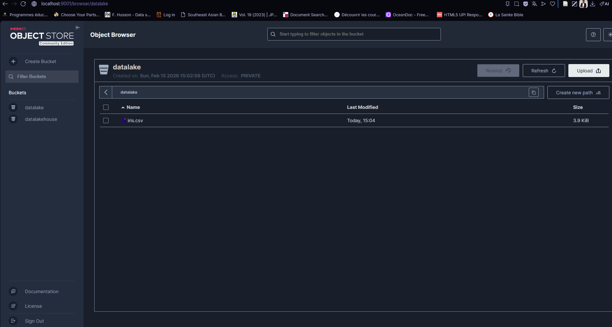
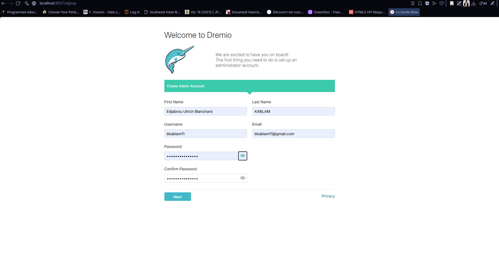
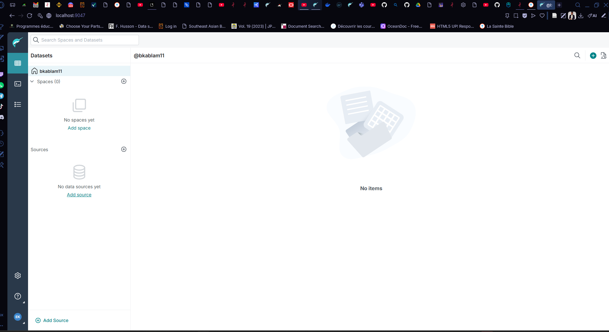
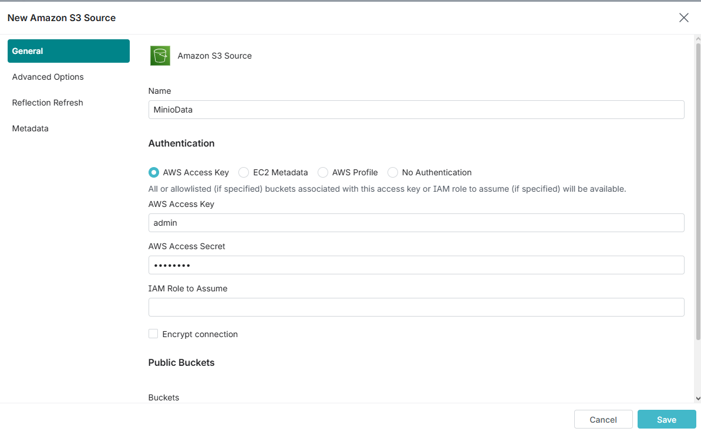
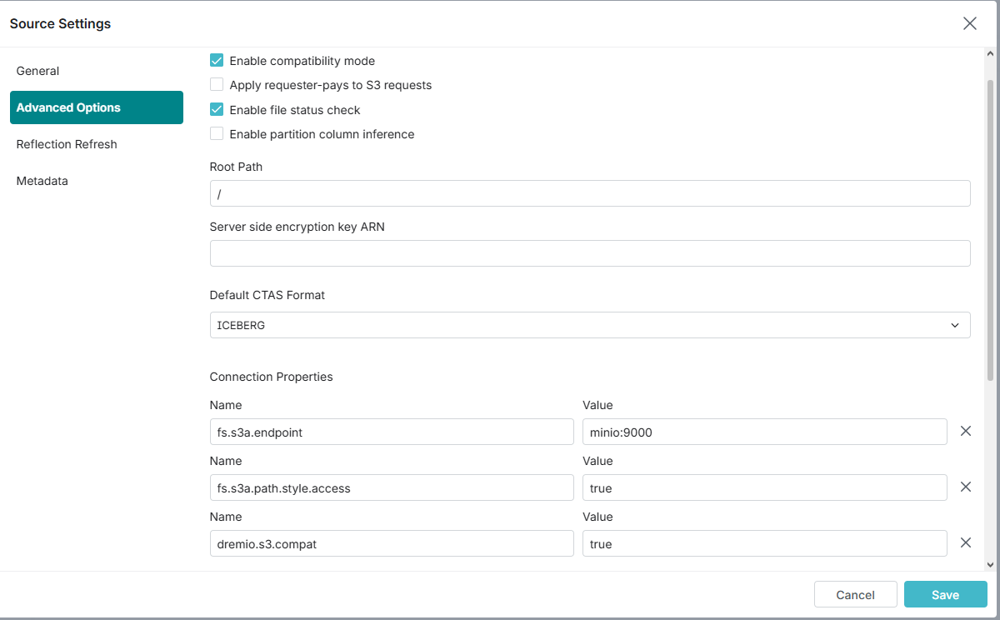
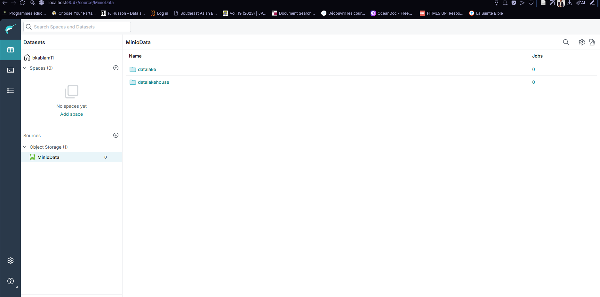

# Guide Complet : Installation Data Lakehouse Local (Dremio + MinIO) sur Docker Windows

Ce guide explique comment monter un environnement Big Data local. Nous utiliserons le dépôt Git.

**Objectif :** Connecter **Dremio** (Moteur de requête) à **MinIO** (Stockage) en utilisant le connecteur **Amazon S3**.

---

## 1. Prérequis et Installation

### A. Installer Docker Desktop pour Windows
Si ce n'est pas déjà fait :
1.  Téléchargez l'installateur : [Lien Officiel Docker Desktop](https://desktop.docker.com/win/main/amd64/Docker%20Desktop%20Installer.exe?utm_source=docker&utm_medium=webreferral&utm_campaign=docs-driven-download-win-amd64&_gl=1*j4738o*_gcl_au*MTAxNzQ5MDc3MC4xNzcwODQwNTc5*_ga*MzcwNzQxNDA3LjE3NzA4NDA1Nzg.*_ga_XJWPQMJYHQ*czE3NzEwOTM5NjckbzYkZzEkdDE3NzEwOTM5NzAkajU3JGwwJGgw)
2.  Installez-le en gardant les options par défaut (WSL 2 recommandé).
3.  **Redémarrez votre ordinateur**.

### B. Récupérer le projet
1.  Créez un dossier pour vos projets.
2.  Ouvrez un terminal (PowerShell ou Invite de commandes).
3.  Clonez le dépôt :
    ```bash
    git clone https://github.com/bkablam11/demo-minio-dremio.git
    ```
4.  **Entrez dans le dossier** (Étape critique pour éviter l'erreur *"configuration file not found"*) :
    ```bash
    cd demo-minio-dremio
    ```

---

## 2. Préparation des Images et Données (Anti-Erreurs)

### A. Téléchargement manuel des images
Pour éviter l'erreur `TLS handshake timeout` due à une connexion lente ou instable, téléchargez les images principales une par une avant de lancer le tout :

```bash
# Image Dremio (avec Superset intégré)
docker pull dremio/dremio-oss

# Image MinIO (Stockage)
docker pull minio/minio

```

### B. Placement des données (Seed Data)
Le projet est configuré pour charger automatiquement des fichiers dans MinIO si vous les placez au bon endroit sur votre Windows.

*   **Pour MinIO :** Mettez vos fichiers (CSV, Parquet, JSON) dans le dossier :
    `./minio-data` (situé dans le dossier que vous avez cloné).

---

## 3. Lancement des Services

Une fois les images téléchargées, Allez dans Docker et lancer l'orchestration des containers.
```bash
# Orchestration des containers
docker-compose up -d minio dremio
# Verification des containers allumés
docker ps
# Arret des containers
docker-compose down
```

> **Vérification :** Ouvrez Docker Desktop. Vous devriez voir un groupe `dremio-demo-env` avec les conteneurs `minio`, `dremio`, etc. allumés en vert.

---

## 4. Configuration de MinIO (Le "Lake")

1.  Accédez à l'interface : **[http://localhost:9001](http://localhost:9001)**
2.  Identifiants :
    *   User : `admin`
    *   Password : `password`
3.  Vérifiez que vos fichiers placés dans le dossier `./minio-data` apparaissent bien dans le bucket. Sinon, créez un bucket nommé `datalake` et uploadez un fichier manuellement.



---

## 5. Configuration de Dremio (Le "House") - ÉTAPE CRUCIALE

C'est ici que nous connectons Dremio à MinIO en utilisant le protocole S3.

1.  Accédez à l'interface : **[http://localhost:9047](http://localhost:9047)**
2.  Créez votre compte administrateur.
3.  Cliquez sur le bouton **+ Add Source** (en bas à gauche).
4.  Sélectionnez **Amazon S3**.





### 3. Connexion de Dremio à MinIO (S3)

Pour connecter Dremio à votre stockage MinIO local, nous allons utiliser le connecteur **Amazon S3** en mode compatibilité.

1.  Cliquez sur le bouton **Add Source** (le `+` bleu) et sélectionnez **Amazon S3**.
2.  Remplissez le formulaire comme suit :

#### A. Onglet "General" (Authentification)

Remplissez les informations d'identification définies dans votre fichier `docker-compose.yml` :

*   **Name :** `MinioData` (Ce sera le nom de la source dans Dremio).
*   **Authentication :** Laissez sur `AWS Access Key`.
*   **AWS Access Key :** `admin`
*   **AWS Access Secret :** `password`
*   **Encrypt connection :** ❌ **DÉCOCHEZ OBLIGATOIREMENT CETTE CASE**.
    *   *Note : MinIO tourne en HTTP local sans certificat SSL. Si vous laissez coché, la connexion échouera.*



#### B. Onglet "Advanced Options" (Configuration Réseau)

C'est ici que nous disons à Dremio de ne pas aller sur le vrai Amazon AWS, mais sur notre conteneur Docker.

1.  Cochez la case **Enable compatibility mode** (si disponible).
2.  Dans la section **Connection Properties**, ajoutez les propriétés suivantes une par une :

| Name (Nom) | Value (Valeur) | Explication Technique |
| :--- | :--- | :--- |
| **`fs.s3a.endpoint`** | `minio:9000` | **Crucial :** Indique l'adresse du conteneur dans le réseau Docker. |
| **`fs.s3a.path.style.access`** | `true` | Force l'URL sous la forme `domaine/bucket` (requis par MinIO). |
| **`dremio.s3.compat`** | `true` | Active les correctifs de compatibilité S3 pour Dremio. |

> **⚠️ Attention au piège :** Ne mettez pas `localhost:9000` dans le endpoint !
> Dremio tourne dans un conteneur. Pour lui, `localhost` c'est lui-même. Il doit contacter le conteneur `minio` via son nom de service Docker.

3.  Cliquez sur **Save**.


***



## 6. Récapitulatif des Accès (URLs)

Voici les adresses pour accéder à tous vos services locaux une fois lancés :

*   **Dremio (Requêtes SQL) :** [http://localhost:9047](http://localhost:9047)
*   **MinIO (Stockage) :** [http://localhost:9001](http://localhost:9001)

---


## 🛠️ Dépannage des erreurs fréquentes

| Erreur | Cause probable | Solution |
| :--- | :--- | :--- |
| `TLS handshake timeout` | Connexion internet saturée lors du téléchargement des images. | Faire les `docker pull` manuellement un par un (voir Étape 2). |
| `no configuration file provided` | Vous n'êtes pas dans le bon dossier. | Faites `cd le_nom_du_dossier` avant de lancer docker-compose. |
| `Unsupported or unrecognized SSL message` | Dremio essaie de parler HTTPS à MinIO HTTP. | **Décochez** "Encrypt connection" dans la source Dremio. |
| `UnknownHostException` | Dremio ne trouve pas le serveur. | Dans `fs.s3a.endpoint`, mettez `minio:9000` au lieu de localhost. |

---
## 7. Premières Requêtes SQL (Transformation & Analyse)

Une fois la source connectée, vous verrez vos fichiers (ex: `iris.csv`). Par défaut, Dremio les voit comme de simples fichiers textes. Nous devons les convertir en **Tables (Datasets)**.

### A. Transformer le CSV en Dataset
1.  Dans l'interface Dremio, passez la souris sur le fichier **`iris.csv`**.
2.  Cliquez sur l'icône **"Format Settings"** (le petit dossier ou crayon à droite du nom).
3.  Configurez comme suit :
    *   **Format :** `Text (delimited)`
    *   **Field Delimiter :** `,` (Comma)
    *   ✅ **Cochez "Extract Field Names"** (Indispensable pour avoir les en-têtes de colonnes).
4.  Cliquez sur **Save**.
    *   *Résultat :* L'icône du fichier devient violette. C'est maintenant une table prête à l'emploi.

### B. Exécuter du SQL
Cliquez sur le bouton **New Query** (ou SQL Runner) en haut à gauche et testez ces commandes :

**1. Voir les données :**
```sql
SELECT * 
FROM MinioData.datalake."iris.csv"
LIMIT 20
```

**2. Compter les lignes :**
```sql
SELECT COUNT(*) as total_fleurs
FROM MinioData.datalake."iris.csv"
```

**3. Agrégation (Moyenne par espèce) :**
C'est ici la puissance du Lakehouse : faire des stats sur un fichier CSV comme si c'était une base de données.
```sql
SELECT 
    species, 
    AVG(sepal_length) as moyenne_sepal,
    AVG(petal_length) as moyenne_petal
FROM MinioData.datalake."iris.csv"
GROUP BY species
```

### C. Créer une "Vue" (Virtual Dataset)
Pour sauvegarder votre travail sans dupliquer la donnée :
1.  Exécutez la requête d'agrégation ci-dessus (n°3).
2.  Cliquez sur la flèche à côté du bouton **Save Script** -> **Save View as...**.
3.  Nommez-la `stats_iris` et enregistrez-la dans votre espace.
    *   *Avantage :* Si vous modifiez le fichier CSV dans MinIO, cette vue se mettra à jour automatiquement !

> **Note :** Le fichier `README.pdf` visible dans MinIO ne peut pas être requêté. Dremio ne traite que la donnée structurée (CSV, JSON, Parquet, Iceberg).
